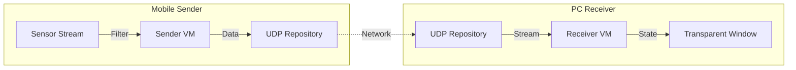

# Mobile Laser Pointer (Rsupport Assignment)

모바일 기기(Android/iOS)의 센서를 이용하여 PC(Windows/macOS) 화면의 포인터를 제어하는 **원격 레이저 포인터 애플리케이션**입니다.

> **플랫폼 지원:** 모바일(Android/iOS), PC(Windows/macOS)만 지원하며, 웹(Web) 플랫폼은 지원하지 않습니다.

## 목차 (Table of Contents)

- [Architecture & Tech Stack](#architecture--tech-stack)
- [요구사항 문서](#요구사항-문서)
- [기능 명세서](#기능-명세서)

---

## Architecture & Tech Stack

유지보수성과 확장성을 고려하여 **Feature-First MVVM + Repository** 패턴을 적용했습니다.

### Tech Stack
- **Framework:** Flutter 3.x
- **State Management:** **Riverpod** (비동기 스트림 처리 및 DI)
- **Routing:** **GoRouter** (플랫폼별 자동 분기 처리)
- **Network:** UDP (Low Latency Data Transmission)
- **Platform Control:** `window_manager` (Desktop), `sensors_plus` (Mobile)

### Architecture Overview

#### Story 1: 프로젝트 기반 및 아키텍처 수립

프로젝트에 적합한 아키텍처 수립 및 프로젝트 셋팅 

##### Check List 

[V] 핵심 패키지 선정 및 추가 (Riverpod, GoRouter, Sensors, WindowManager)

[V] Feature-First 폴더 구조(Core, Domain, Features) 세팅

[V] GoRouter를 활용한 플랫폼별(Mobile vs Desktop) 진입점 분기 구현

---

#### Story 2: UDP 통신을 위한 공통 데이터 모델 (LaserPacket) 구현

UDP 통신에 사용할 공통 데이터 모델 구현

##### Check List

[V] LaserPacket 모델 정의 (Freezed + JSON 직렬화)
- X, Y 좌표 필드
- 클릭 상태 필드
- JSON 직렬화/역직렬화 지원

[V] 코드 생성 설정 및 실행

---

#### Story 3: Receiver (PC) 기능 구현

데스크톱 수신기 기능 및 자동 연결 로직 구현

##### Check List

[V] UDP 소켓 바인딩 및 패킷 수신 로직 구현 (ReceiverRepository)

[V] 수신 상태 관리 및 자동 연결/해제 로직 (Timeout Timer 적용)

[V] 투명 윈도우 오버레이 구현 (Always-on-top, Click-through)

[V] 수신 데이터 시각화 (좌표 매핑 및 레이저 포인터 렌더링)

---

#### Story 4: Sender (Mobile) 기능 구현

모바일 센서 데이터 처리 및 전송 로직 구현

##### Check List

[V] UDP 패킷 전송 로직 구현 (SenderRepository)

[V] 자이로스코프(Gyroscope) 센서 연동 및 좌표 데이터 가공

[V] 제어 화면(Control Screen) UI 구현 (터치패드 및 연결 제어)

[V] 생명주기 관리 (화면 진입/이탈 시 전송 자동 제어)

---

#### Story 5: 연결 편의성 및 멀티 모니터 지원

QR 코드 연결 및 듀얼 모니터 환경 대응을 위한 UX 개선

##### Check List

[V] 앱 실행 흐름 재설계 (Setup 화면 -> Control/Overlay 화면 분리)

[V] [PC] 설정 마법사 구현
- 현재 IP QR코드 생성 및 표시 (qr_flutter)
- 다중 모니터 감지 및 대상 디스플레이 선택 (screen_retriever)

[V] [Mobile] 간편 연결 구현
- QR 코드 스캐너 연동 (mobile_scanner)
- IP 자동 입력 및 즉시 연결

---

#### Story 6: 코드 리팩토링 및 안정성 확보

유지보수성 향상을 위한 최신 문법 적용 및 구조 개선

##### Check List

[V] State Management 고도화 (Riverpod 3.0 Generator 문법 적용)

[V] 컴포넌트 분리 및 모듈화 (Setup / Overlay / Control)

[V] 전역 에러 핸들링 및 Custom Exception 구조 수립

[V] Dart 3.x 최신 문법 적용 (Records, Patterns, Modifiers)

## 요구사항 문서

프로젝트의 비즈니스 및 사용자 요구사항은 다음 문서를 참고하세요:

- [📋 Requirements Specification (요구사항 정의서)](doc/REQUIREMENTS.md)

## 기능 명세서

프로젝트의 상세 기능 명세는 다음 문서를 참고하세요:

- [⚙️ Functional Specifications (기능 명세서)](doc/FUNCTIONAL_SPEC.md)

