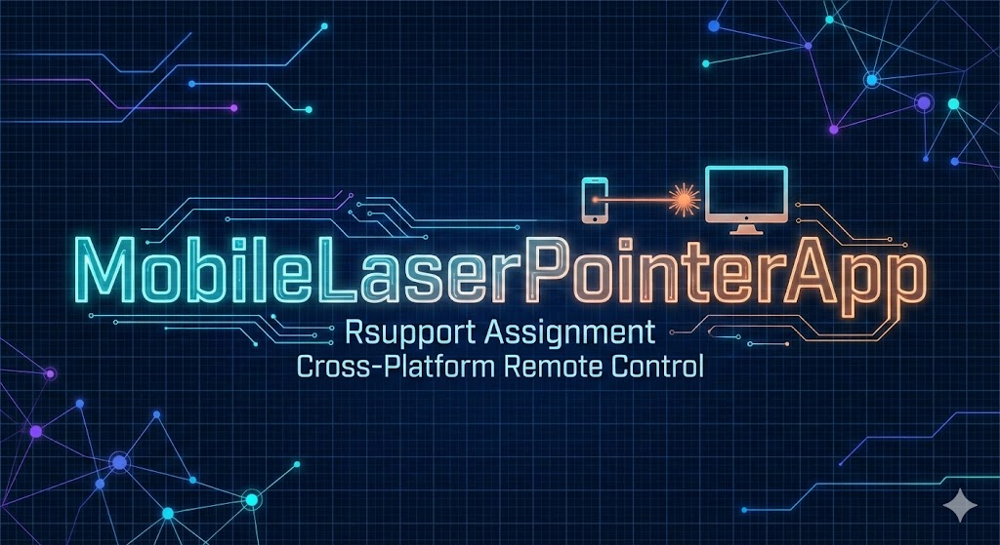
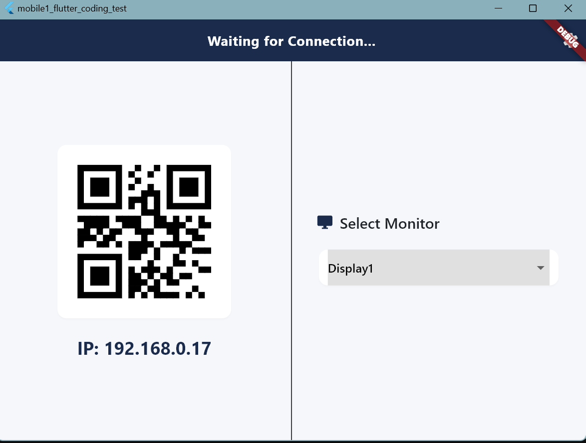
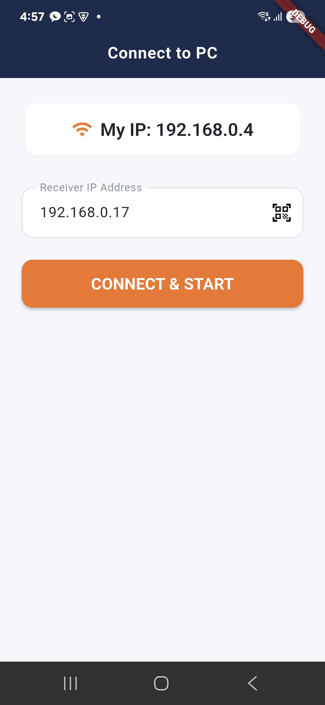
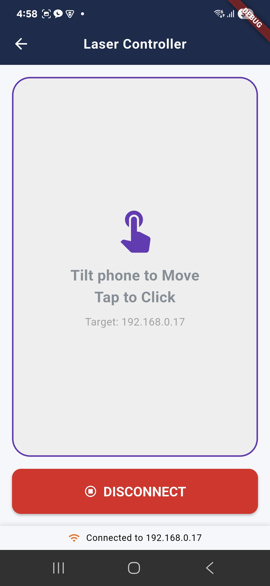
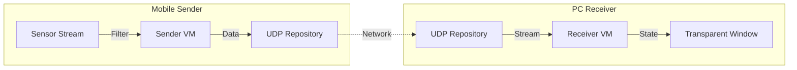

# Mobile Laser Pointer (Rsupport Assignment)

<div align="center">
  
</div>

모바일 기기(Android/iOS)의 센서를 이용하여 PC(Windows/macOS) 화면의 포인터를 제어하는 **원격 레이저 포인터 애플리케이션**입니다.

> **플랫폼 지원:** 모바일(Android/iOS), PC(Windows/macOS)만 지원하며, 웹(Web) 플랫폼은 지원하지 않습니다.

## 목차 (Table of Contents)

1. [사용방법 (How to Use)](#1-사용방법-how-to-use)
   1-1. [PC (수신기) 앱 실행](#1-1-pc-수신기-앱-실행)
   1-2. [모바일 (송신기) 앱 실행](#1-2-모바일-송신기-앱-실행)
   1-3. [연결하기](#1-3-연결하기)
   1-4. [포인터 제어하기](#1-4-포인터-제어하기)
   1-5. [포인터 옵션 설정](#1-5-포인터-옵션-설정)
   1-6. [디스플레이 선택](#1-6-디스플레이-선택)
2. [Architecture & Tech Stack](#2-architecture--tech-stack)
   2-1. [Tech Stack](#2-1-tech-stack)
   2-2. [Architecture Overview](#2-2-architecture-overview)
3. [시작하기 (Getting Started)](#3-시작하기-getting-started)
   3-1. [전제 조건 (Prerequisites)](#3-1-전제-조건-prerequisites)
   3-2. [설치 (Installation)](#3-2-설치-installation)
   3-3. [실행 방법 (How to Run)](#3-3-실행-방법-how-to-run)
4. [프로젝트 구조 (Project Structure)](#4-프로젝트-구조-project-structure)
5. [기능 및 폴더 설명](#5-기능-및-폴더-설명)
   5-1. [Features/Sender (Mobile)](#5-1-featuressender-mobile)
   5-2. [Features/Receiver (PC)](#5-2-featuresreceiver-pc)
   5-3. [Core & Domain](#5-3-core--domain)
6. [주의사항 (Notes)](#6-주의사항-notes)
   6-1. [네트워크 환경](#6-1-네트워크-환경)
   6-2. [플랫폼 권한 (Permissions)](#6-2-플랫폼-권한-permissions)
   6-3. [Flutter & Package 버전](#6-3-flutter--package-버전)
   6-4. [코드 생성 (Code Generation)](#6-4-코드-생성-code-generation)
7. [AI와 인간의 역할 분담](#7-ai와-인간의-역할-분담)
   7-1. [AI의 역할](#7-1-ai의-역할)
   7-2. [인간의 역할](#7-2-인간의-역할)
8. [개발 이력](#8-개발-이력)
9. [문서 (Documents)](#9-문서-documents)
10. [향후 추가할 수 있는 기능들](#10-향후-추가할-수-있는-기능들)

---

## 1. 사용방법 (How to Use)

본 앱의 사용 방법에 대한 상세 가이드입니다. 더 자세한 내용은 [사용 가이드](doc/USAGE.md)를 참고하세요.

### 앱 화면 미리보기

| PC (수신기) 화면 | 모바일 설정 화면 | 모바일 제어 화면 |
|:---:|:---:|:---:|
|  |  |  |
| PC에서 수신 대기 상태로 QR 코드와 모니터 선택 화면 | 모바일에서 PC IP 주소 입력 및 연결 화면 | 모바일에서 포인터 제어 화면 |

### 1-1. PC (수신기) 앱 실행

1. PC에서 Flutter 프로젝트를 실행합니다:
   ```bash
   # macOS
   flutter run -d macos
   
   # Windows
   flutter run -d windows
   ```

2. 앱이 실행되면 **설정 화면**이 표시됩니다.
   - 화면 왼쪽: 현재 PC의 IP 주소가 포함된 **QR 코드**가 표시됩니다.
   - 화면 오른쪽: 사용 가능한 **모니터 선택** 드롭다운이 표시됩니다.

3. **모니터 선택** (선택사항):
   - 여러 모니터가 연결된 경우, 드롭다운에서 원하는 모니터를 선택할 수 있습니다.
   - 선택한 모니터에 포인터가 표시됩니다.

4. 앱은 자동으로 **수신 대기 상태**로 전환됩니다.
   - 화면 상단에 "Waiting for Connection..." 메시지가 표시됩니다.

### 1-2. 모바일 (송신기) 앱 실행

1. 모바일 기기에서 Flutter 프로젝트를 실행합니다:
   ```bash
   # 연결된 디바이스 확인
   flutter devices
   
   # 디바이스 선택 후 실행
   flutter run -d <device_id>
   ```

2. 앱이 실행되면 **설정 화면**이 표시됩니다.
   - IP 주소 입력 필드가 표시됩니다.
   - QR 코드 스캔 버튼이 표시됩니다.

### 1-3. 연결하기

#### QR 코드 스캔 방법 (권장)

1. 모바일 앱에서 **QR 코드 스캔 버튼**을 누릅니다.
2. 카메라가 열리면 PC 화면에 표시된 **QR 코드를 스캔**합니다.
3. IP 주소가 자동으로 입력되고 **연결 버튼**을 누릅니다.
4. 연결이 완료되면 자동으로 **제어 화면**으로 이동합니다.

#### IP 주소 직접 입력 방법

1. PC 화면에 표시된 **IP 주소**를 확인합니다 (예: `192.168.0.100`).
2. 모바일 앱의 **IP 주소 입력 필드**에 IP 주소를 입력합니다.
3. **연결 버튼**을 누릅니다.
4. 연결이 완료되면 자동으로 **제어 화면**으로 이동합니다.

### 1-4. 포인터 제어하기

1. **포인터 이동**:
   - 스마트폰을 **기울여서** 포인터를 이동시킵니다.
   - 자이로스코프 센서를 사용하여 기기의 회전 각도를 감지합니다.

2. **클릭하기**:
   - 화면 하단의 **"Tap to Click"** 영역을 터치합니다.
   - 터치하는 동안 포인터가 활성화되고 잔상이 생성됩니다.

### 1-5. 포인터 옵션 설정

PC 앱에서 포인터의 스타일을 변경할 수 있습니다.

1. PC 앱의 설정 화면에서 상단의 **설정 아이콘(⚙️)**을 클릭합니다.
2. 옵션 화면에서 다음을 조정할 수 있습니다:
   - **포인터 색상**: 다양한 색상 옵션 중에서 선택
   - **포인터 크기**: 10px ~ 50px 범위로 조정
   - **잔상 지속시간**: 100ms ~ 2000ms 범위로 조정

### 1-6. 디스플레이 선택

여러 모니터가 연결된 PC에서 사용하는 경우:

1. PC 설정 화면의 오른쪽에서 **모니터 선택 드롭다운**을 확인합니다.
2. 원하는 모니터를 선택합니다 (예: Display1, Display2).
3. 선택한 모니터에 포인터가 표시됩니다.

더 자세한 사용 방법은 [사용 가이드](doc/USAGE.md)를 참고하세요.

---

## 2. Architecture & Tech Stack

유지보수성과 확장성을 고려하여 **Feature-First MVVM + Repository** 패턴을 적용했습니다.

### 2-1. Tech Stack
- **Framework:** Flutter 3.38.4 (고정, Visual Studio 2026 호환성)
- **State Management:** **Riverpod** (비동기 스트림 처리 및 DI)
- **Routing:** **GoRouter** (플랫폼별 자동 분기 처리)
- **Network:** UDP (Low Latency Data Transmission)
- **Platform Control:** `window_manager` (Desktop), `sensors_plus` (Mobile)

### 2-2. Architecture Overview


---

## 3. 시작하기 (Getting Started)

이 프로젝트를 로컬 환경에서 실행하기 위한 방법입니다.

### 3-1. 전제 조건 (Prerequisites)

- [Flutter SDK](https://docs.flutter.dev/get-started/install) **Version 3.38.4 (필수, Visual Studio 2026 호환성)**
- Android Studio 또는 VS Code
- 테스트를 위한 모바일 기기 (Android/iOS) 및 PC (Windows/macOS)
- **중요:** 모바일 기기와 PC는 **동일한 Wi-Fi 네트워크**에 접속해 있어야 합니다.

### 3-2. 설치 (Installation)

프로젝트 클론 후 의존성 패키지를 설치합니다.

```bash
flutter pub get
```

코드 생성이 필요한 경우 (Freezed, Riverpod Generator 등):

```bash
flutter pub run build_runner build --delete-conflicting-outputs
```

### 3-3. 실행 방법 (How to Run)

본 프로젝트는 하나의 코드베이스로 Mobile(송신)과 Desktop(수신)을 모두 처리합니다.

#### 1. PC Receiver (수신부) 실행

먼저 PC에서 애플리케이션을 실행하여 수신 대기 상태로 만듭니다.

```bash
# macOS
flutter run -d macos

# Windows
flutter run -d windows
```

- 앱이 실행되면 현재 PC의 IP 주소가 화면에 표시됩니다 (또는 설정 메뉴 확인).
- 방화벽 경고가 뜨는 경우, **네트워크 액세스 허용**을 해야 합니다.

#### 2. Mobile Sender (송신부) 실행

모바일 기기에서 애플리케이션을 실행합니다.

```bash
# 연결된 디바이스 확인
flutter devices

# 디바이스 선택 후 실행
flutter run -d <device_id>
```

- 앱 실행 후, PC 화면에 표시된 IP 주소를 입력하거나 QR 코드를 스캔하여 연결합니다.
- 연결이 완료되면 스마트폰을 움직여 PC의 포인터를 제어할 수 있습니다.

---

## 4. 프로젝트 구조 (Project Structure)

Feature-First 아키텍처에 따라 기능별로 디렉토리를 구분했습니다.

```
lib/
├── main.dart                # 앱 진입점 (Entry Point)
│
├── core/                    # 공통 유틸리티 및 설정
│   ├── constants/           # 상수 값 (포트 번호, 타임아웃 등)
│   │   └── app_constants.dart
│   ├── router/              # GoRouter 설정 (플랫폼 분기 처리)
│   │   └── app_router.dart
│   ├── theme/               # 앱 테마 및 스타일
│   │   └── app_theme.dart
│   ├── network/             # 네트워크 관련 유틸리티
│   └── errors/              # 에러 처리 및 핸들러
│
├── domain/                  # 도메인 모델 (공유 엔티티)
│   └── models/
│       └── laser_packet.dart  # UDP 패킷 데이터 모델
│
└── features/                # 핵심 기능 모듈
    ├── sender/              # [Mobile] 송신 기능 관련
    │   ├── data/            # UDP 전송 로직
    │   │   └── sender_repository.dart
    │   └── presentation/    # 모바일 UI 화면 및 ViewModel
    │       ├── views/       # 화면 위젯
    │       ├── viewmodels/  # 상태 관리 (Riverpod)
    │       ├── widgets/     # 재사용 가능한 위젯
    │       └── constants/   # 화면별 상수
    │
    └── receiver/            # [PC] 수신 기능 관련
        ├── data/            # UDP 수신 및 패킷 파싱
        │   └── receiver_repository.dart
        └── presentation/    # PC 오버레이 UI 및 ViewModel
            ├── views/       # 화면 위젯
            ├── viewmodels/  # 상태 관리 (Riverpod)
            ├── widgets/     # 재사용 가능한 위젯
            └── constants/   # 화면별 상수
```

---

## 5. 기능 및 폴더 설명

각 주요 폴더 및 기능에 대한 상세 설명입니다.

### 5-1. Features/Sender (Mobile)

모바일 기기에서 실행되는 로직입니다.

- **Sensor Logic:** `sensors_plus` 패키지를 사용하여 자이로스코프 및 가속도계 데이터를 수집합니다.
- **Data Filtering:** 센서 데이터의 노이즈를 제거하고 이동 좌표로 변환합니다.
- **UDP Client:** 변환된 좌표 데이터를 UDP 패킷으로 PC에 전송합니다.
- **UI:** IP 주소 입력, QR 코드 스캔, 터치패드 제어 화면을 제공합니다.

### 5-2. Features/Receiver (PC)

PC(Desktop) 환경에서 실행되는 로직입니다.

- **UDP Server:** 특정 포트(50051)를 열어 모바일로부터 데이터를 수신합니다.
- **Window Control:** `window_manager`를 통해 배경이 투명한 오버레이 윈도우를 생성하고 "Always on Top" 상태를 유지합니다.
- **Rendering:** 수신된 좌표에 맞춰 화면에 레이저 포인터 UI를 그립니다.
- **QR Code:** 현재 PC의 IP 주소를 QR 코드로 표시하여 모바일 연결을 용이하게 합니다.

### 5-3. Core & Domain

- **GoRouter:** 앱 실행 시 `Platform.isAndroid || Platform.isIOS` 여부를 체크하여 자동으로 `/sender` 또는 `/receiver` 라우트로 이동시킵니다.
- **Network:** UDP 통신의 지연 시간을 최소화하기 위한 로직이 포함되어 있습니다.
- **Domain Models:** `LaserPacket`과 같은 공유 데이터 모델을 정의합니다.

---

## 6. 주의사항 (Notes)

개발 및 빌드 시 다음 사항을 유의해 주세요.

### 6-1. 네트워크 환경

- UDP 통신 특성상 **동일 네트워크(같은 Wi-Fi)** 환경이 필수입니다.
- **방화벽(Firewall):** Windows/macOS의 방화벽이 들어오는 UDP 패킷을 차단할 수 있습니다. 앱 실행 시 네트워크 권한을 허용하거나 방화벽 설정을 확인하세요.
- **포트 충돌:** 기본 설정된 포트(50051)가 이미 사용 중이라면 `lib/core/constants/app_constants.dart`에서 포트 번호를 변경해야 합니다.

### 6-2. 플랫폼 권한 (Permissions)

- **macOS:**
  - `macos/Runner/DebugProfile.entitlements` 및 `Release.entitlements` 파일에 `com.apple.security.network.client` 및 `com.apple.security.network.server` 권한이 추가되어 있어야 합니다.
- **Windows:**
  - 방화벽에서 UDP 포트(50051)에 대한 인바운드 연결을 허용해야 합니다.
- **Android:**
  - 센서 사용을 위한 권한은 보통 자동으로 처리되나, `AndroidManifest.xml`에 인터넷 권한(`<uses-permission android:name="android.permission.INTERNET"/>`)이 필수입니다.

### 6-3. Flutter & Package 버전

- 본 프로젝트는 **Flutter 3.38.4 (고정 버전)**을 사용합니다. Visual Studio 2026과의 호환성을 위해 이 버전으로 고정되어 있습니다.
- 다른 Flutter 버전에서는 호환성 문제가 발생할 수 있으므로 반드시 3.38.4 버전을 사용해 주세요.
- `pubspec.yaml`의 주요 패키지(`riverpod`, `go_router`) 버전 업데이트 시 Breaking Change에 유의하세요.

### 6-4. 코드 생성 (Code Generation)

- Freezed 및 Riverpod Generator를 사용하므로, 모델이나 Provider 변경 후에는 다음 명령어를 실행해야 합니다:

```bash
flutter pub run build_runner build --delete-conflicting-outputs
```

---

## 7. AI와 인간의 역할 분담

본 프로젝트는 AI 코딩 어시스턴트(Cursor)와 인간 개발자 간의 협업을 통해 개발되었습니다. AI가 자동으로 적용하는 규칙과 프롬프트를 명시하여 일관된 코드 품질을 유지합니다.

### 7-1. AI의 역할

AI 코딩 어시스턴트는 다음 규칙들을 자동으로 적용하여 코드를 작성하고 리팩토링합니다:

#### 7-1-1. 문서화 규칙 (Documentation Rules)

**트리거**: "document code", "add dart doc", "주석 달아줘", `/doc` 명령어 사용 시

**규칙 파일**: `.cursor/commands/docs.md`

- **언어**: 항상 한국어로 작성 (명시적 요청 시 제외)
- **문법**: `///` (triple slashes) 사용, `/** ... */` 사용 금지
- **요약 문장**: 첫 문장은 간결하고 독립적인 요약으로 마침표로 끝남
- **문체**:
  - 함수/메서드: 3인칭 동사로 시작 (예: "계산합니다...", "업데이트합니다...")
  - 변수/속성: 명사구로 시작 (예: "현재 너비는...")
  - 불린 값: "~인지 여부" 형식 선호 (예: "화면이 켜져 있는지 여부입니다.")
- **참조**: 대괄호 `[...]`로 매개변수, 변수, 클래스, 예외 링크
- **마크다운**: 코드 키워드나 값은 백틱 사용 (예: `true`, `null`)

#### 7-1-2. 에러 처리 및 Null Safety 규칙

**트리거**: 비즈니스 로직, Repository, 에러 처리 코드 작성 시

**규칙 파일**: `.cursor/commands/error.md`

- **엄격한 Null Safety**:
  - `!` (bang operator) 사용 금지 (수학적으로 null이 아님을 증명할 수 있는 경우 제외)
  - `late` 키워드 지양, nullable 타입 또는 `AsyncValue` 사용
  - 필수 매개변수는 `required` 사용
- **예외 계층 구조**:
  - 일반 `Exception()` 또는 `Error()` 던지기 금지
  - 도메인별 커스텀 예외 정의 (`AppException` 확장)
  - 예: `NetworkException`, `SensorException`, `ValidationException`
  - Repository 레이어에서 3rd-party 에러를 캐치하여 커스텀 예외로 래핑
- **전역 에러 처리**:
  - UI 위젯에서 임시 `try-catch-print` 블록 사용 금지
  - Riverpod 통합: `AsyncValue.guard(() => ...)` 사용
  - 미처리 에러는 전역 핸들러로 라우팅 (로깅 및 사용자 알림)

#### 7-1-3. 리팩토링 및 현대화 규칙

**트리거**: "/refactor", "clean up", "modernize", "코드 정리", "리팩토링", "분리해줘" 요청 시

**규칙 파일**: `.cursor/commands/refactor.md`

- **Dart 3.x 현대 문법**:
  - Switch Expressions 사용 (verbose `switch`/`if-else`를 간결한 표현식으로 변환)
  - Records 사용 (간단한 헬퍼 클래스 대신 `(double x, double y)` 형식)
  - `final`, `const`, `required` 엄격히 사용
- **상태 관리 (Riverpod v3 / Generator Style)**:
  - 수동 Provider 정의 금지 (`StateNotifierProvider` 또는 `Provider` 수동 정의 금지)
  - Generator 문법:
    - 함수 기반: 읽기 전용 값 (`@riverpod`)
    - 클래스 기반: 변경 가능한 상태 (extends `_$Name`)
  - 비동기: `AsyncNotifier`의 `build()`에서 `Future<T>` 반환
  - 비즈니스 로직은 Notifier에 유지, UI에 두지 않음
- **컴포넌트 모듈화**:
  - `build` 메서드가 50줄 이상이면 하위 위젯 추출
  - 추출된 위젯은 책임에 따라 명명 (예: `_StatusBadge`)
  - 위젯 분리: `widgets/` 폴더에 개별 파일로 이동
  - 위젯 내보내기: `widgets/widgets.dart` 생성하여 단일 진입점 제공
  - 상수 분리: `constants/` 폴더에 설명적인 클래스 이름 사용 (예: `ReceiverScreenConstants`)
  - 상수 내보내기: `constants/constants.dart` 생성하여 단일 진입점 제공
  - 구조: `features/{feature}/presentation/{widgets|constants|views}/` 패턴 따름

### 7-2. 인간의 역할

- **아키텍처 설계**: 전체 시스템 구조 및 패턴 결정
- **비즈니스 로직 검토**: AI가 생성한 코드의 로직 정확성 검증
- **통합 테스트**: 실제 디바이스에서의 동작 확인
- **성능 최적화**: 병목 지점 식별 및 개선 방향 결정
- **규칙 정의**: AI가 따를 규칙 및 프롬프트 작성 및 업데이트


---

## 8. 개발 이력

프로젝트 개발 과정에서 완료된 주요 작업들을 Story 단위로 정리한 문서입니다.

- [📜 Development History (개발 이력)](doc/HISTORY.md)

---

## 9. 문서 (Documents)

프로젝트 상세 문서는 `doc/` 폴더 내에 위치합니다.

- [📖 사용 가이드 (User Guide)](doc/USAGE.md)
- [📜 Development History (개발 이력)](doc/HISTORY.md)
- [📋 Requirements Specification (요구사항 정의서)](doc/REQUIREMENTS.md)
- [⚙️ Functional Specifications (기능 명세서)](doc/FUNCTIONAL_SPEC.md)

---

## 10. 향후 추가할 수 있는 기능들

본 프로젝트의 확장 가능성과 향후 개선 방향을 제시합니다.

### 10-1. 자주 사용하는 IP 즐겨찾기

**기능 설명**: 사용자가 자주 연결하는 PC의 IP 주소를 즐겨찾기로 저장하여 빠르게 접근할 수 있는 기능입니다.

**구현 방안**:
- **로컬 저장소**: `shared_preferences` 또는 `hive` 패키지를 사용하여 IP 주소 목록을 로컬에 저장
- **UI 구성**: 설정 화면에 "즐겨찾기" 섹션 추가, IP 주소별 별명 설정 가능
- **빠른 접근**: 즐겨찾기 목록에서 탭 한 번으로 연결 가능
- **데이터 모델**: `FavoriteIp` Freezed 모델 생성 (IP 주소, 별명, 마지막 연결 시간 등)

### 10-2. 하나의 Desktop에 여러 모바일 앱 접속 방지

**기능 설명**: 하나의 PC(Desktop)에 여러 모바일 앱이 동시에 접속하는 것을 방지하여 포인터 충돌을 예방합니다.

**구현 방안**:
- **연결 상태 관리**: `ReceiverViewModel`에서 현재 연결된 모바일 기기 정보를 추적
- **접속 거부 로직**: 새로운 연결 시도 시 이미 연결된 기기가 있으면 UDP 패킷으로 거부 메시지 전송
- **연결 해제 감지**: 기존 연결이 끊어지면 자동으로 새로운 연결 허용
- **사용자 알림**: 모바일 앱에서 "이미 다른 기기가 연결되어 있습니다" 메시지 표시

### 10-3. 프레젠테이션 조작 기능

**기능 설명**: 포인터 제어 외에 프레젠테이션 슬라이드 이동, 확대/축소 등 추가 제스처를 지원합니다.

**구현 방안**:
- **제스처 인식**: 모바일에서 스와이프, 핀치 등 제스처를 감지하여 특정 명령으로 변환
- **명령 프로토콜 확장**: `LaserPacket`에 명령 타입 필드 추가 (예: `CommandType` enum: move, click, swipe, zoom)
- **키보드 이벤트 시뮬레이션**: PC에서 `keyboard_listener` 또는 `global_hotkey` 패키지를 사용하여 키보드 이벤트 전송
  - 왼쪽/오른쪽 스와이프 → 화살표 키 (←/→)
  - 위/아래 스와이프 → Page Up/Page Down
  - 핀치 → Ctrl + +/- (확대/축소)
- **UI 추가**: 모바일 제어 화면에 제스처 영역 및 제스처 가이드 표시

### 10-4. 모노레포로 관리

**기능 설명**: 현재 단일 코드베이스 구조를 모노레포(Monorepo) 구조로 전환하여 모바일과 데스크톱 앱을 독립적으로 관리합니다.

**구현 방안**:
- **프로젝트 구조 재구성**:
  ```
  mobile-laser-pointer/
  ├── packages/
  │   ├── core/              # 공통 로직 (UDP 통신, 모델 등)
  │   ├── domain/            # 도메인 모델
  │   └── shared_ui/         # 공통 UI 컴포넌트
  ├── apps/
  │   ├── mobile/            # 모바일 전용 앱
  │   └── desktop/           # 데스크톱 전용 앱
  └── pubspec.yaml           # 루트 pubspec (workspace 설정)
  ```
- **Melos 또는 Puro 사용**: Flutter 모노레포 관리 도구를 사용하여 패키지 간 의존성 관리
- **장점**:
  - 모바일과 데스크톱 앱의 독립적인 버전 관리
  - 공통 코드의 재사용성 향상
  - 각 앱별 빌드 최적화 가능
  - CI/CD 파이프라인 분리 가능

