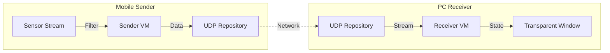

# Mobile Laser Pointer (Rsupport Assignment)

모바일 기기(Android/iOS)의 센서를 이용하여 PC(Windows/macOS) 화면의 포인터를 제어하는 **원격 레이저 포인터 애플리케이션**입니다.

> **플랫폼 지원:** 모바일(Android/iOS), PC(Windows/macOS)만 지원하며, 웹(Web) 플랫폼은 지원하지 않습니다.

## 목차 (Table of Contents)

- [Architecture & Tech Stack](#architecture--tech-stack)
- [개발 이력](#개발-이력)
- [요구사항 문서](#요구사항-문서)
- [기능 명세서](#기능-명세서)

---

## Architecture & Tech Stack

유지보수성과 확장성을 고려하여 **Feature-First MVVM + Repository** 패턴을 적용했습니다.

### Tech Stack
- **Framework:** Flutter 3.x
- **State Management:** **Riverpod** (비동기 스트림 처리 및 DI)
- **Routing:** **GoRouter** (플랫폼별 자동 분기 처리)
- **Network:** UDP (Low Latency Data Transmission)
- **Platform Control:** `window_manager` (Desktop), `sensors_plus` (Mobile)

### Architecture Overview

## 개발 이력

프로젝트 개발 과정에서 완료된 주요 작업들을 Story 단위로 정리한 문서입니다.

- [📜 Development History (개발 이력)](doc/HISTORY.md)

## 요구사항 문서

프로젝트의 비즈니스 및 사용자 요구사항은 다음 문서를 참고하세요:

- [📋 Requirements Specification (요구사항 정의서)](doc/REQUIREMENTS.md)

## 기능 명세서

프로젝트의 상세 기능 명세는 다음 문서를 참고하세요:

- [⚙️ Functional Specifications (기능 명세서)](doc/FUNCTIONAL_SPEC.md)

