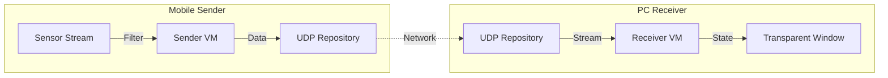

# Mobile Laser Pointer (Rsupport Assignment)

모바일 기기(Android/iOS)의 센서를 이용하여 PC(Windows/macOS) 화면의 포인터를 제어하는 **원격 레이저 포인터 애플리케이션**입니다.

> **플랫폼 지원:** 모바일(Android/iOS), PC(Windows/macOS)만 지원하며, 웹(Web) 플랫폼은 지원하지 않습니다.

## 목차 (Table of Contents)

- [Architecture & Tech Stack](#architecture--tech-stack)
- [요구사항 문서](#요구사항-문서)
- [기능 명세서](#기능-명세서)

---

## Architecture & Tech Stack

유지보수성과 확장성을 고려하여 **Feature-First MVVM + Repository** 패턴을 적용했습니다.

### Tech Stack
- **Framework:** Flutter 3.x
- **State Management:** **Riverpod** (비동기 스트림 처리 및 DI)
- **Routing:** **GoRouter** (플랫폼별 자동 분기 처리)
- **Network:** UDP (Low Latency Data Transmission)
- **Platform Control:** `window_manager` (Desktop), `sensors_plus` (Mobile)

### Architecture Overview

#### Story 1: 프로젝트 기반 및 아키텍처 수립

프로젝트에 적합한 아키텍처 수립 및 프로젝트 셋팅 

##### Check List 

[V] 핵심 패키지 선정 및 추가 (Riverpod, GoRouter, Sensors, WindowManager)

[V] Feature-First 폴더 구조(Core, Domain, Features) 세팅

[V] GoRouter를 활용한 플랫폼별(Mobile vs Desktop) 진입점 분기 구현

---

#### Story 2: UDP 통신을 위한 공통 데이터 모델 (LaserPacket) 구현

UDP 통신에 사용할 공통 데이터 모델 구현

##### Check List

[V] LaserPacket 모델 정의 (Freezed + JSON 직렬화)
- X, Y 좌표 필드
- 클릭 상태 필드
- JSON 직렬화/역직렬화 지원

[V] 코드 생성 설정 및 실행

---

#### Story 3: Receiver (PC) 기능 구현

데스크톱 수신기 기능 구현

##### Check List

[V] UDP 소켓 바인딩 및 패킷 수신 로직 구현
- ReceiverRepository 구현
- 패킷 스트림 처리

[V] 수신기 화면 UI 구현
- 투명 윈도우 설정
- 레이저 포인터 렌더링
- 상태별 테두리 표시 (녹색: 대기중, 빨강: 수신중)

[V] Click-through 이벤트 처리
- 배경 뒤 프로그램에 마우스 이벤트 전달

[ ] ~~종료 버튼 구현~~ (이벤트 through 이슈로 인해 Sender에서 구현 예정)

---

## 요구사항 문서

프로젝트의 비즈니스 및 사용자 요구사항은 다음 문서를 참고하세요:

- [📋 Requirements Specification (요구사항 정의서)](doc/REQUIREMENTS.md)

## 기능 명세서

프로젝트의 상세 기능 명세는 다음 문서를 참고하세요:

- [⚙️ Functional Specifications (기능 명세서)](doc/FUNCTIONAL_SPEC.md)

