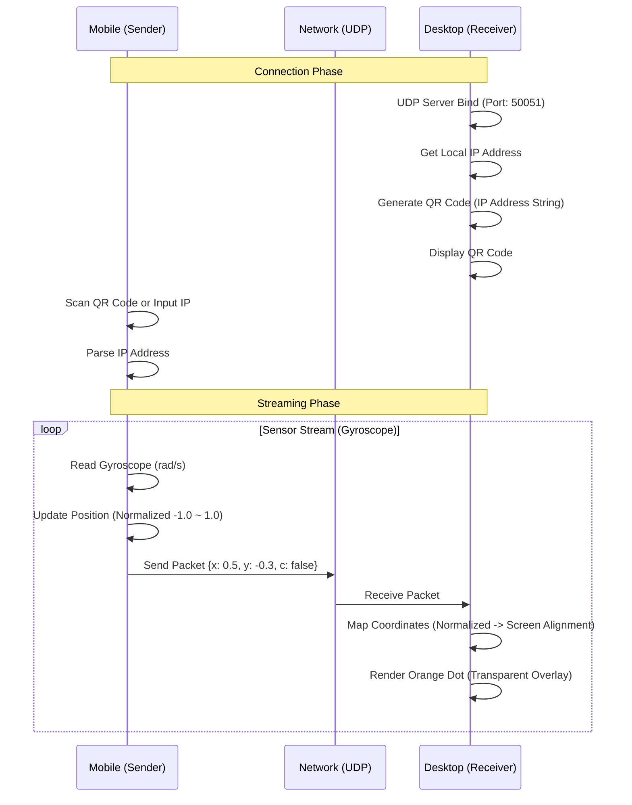

# Functional Specifications (기능 명세서)

## 1. 시스템 구조 (System Architecture)
본 시스템은 **UDP**을 기반으로 하는 **Sender-Receiver** 구조를 따른다.

**플랫폼 지원:**
- 모바일: Android, iOS
- PC: Windows, macOS
- 웹(Web) 플랫폼은 지원하지 않음

## 2. 데이터 프로토콜 (Data Protocol)
모바일과 PC 간의 통신은 JSON 포맷의 문자열을 UTF-8로 인코딩하여 전송한다.

### 2.1. 패킷 구조 (LaserPacket)

| 필드명 | 타입 | 설명 | 예시 |
|--------|------|------|------|
| x | Double | X축 절대 좌표 (정규화된 -1.0 ~ 1.0) | 0.5 |
| y | Double | Y축 절대 좌표 (정규화된 -1.0 ~ 1.0) | -0.3 |
| c | Boolean | 클릭 상태 (true: 클릭 중, false: 일반) | false |

**좌표 시스템:**
- 중심점: (0.0, 0.0)
- 범위: -1.0 ~ 1.0 (정규화된 좌표)
- PC 화면에서 `Alignment(x, y)`로 매핑되어 절대 위치로 변환됨

## 3. 상세 기능 명세 (Detailed Functions)

### 3.1. Sender (Mobile App)

**FUNC-S-01 (Sensor)**: `sensors_plus` 패키지의 `gyroscopeEventStream()`을 사용하여 자이로스코프 이벤트를 실시간으로 수집한다. 자이로스코프는 rad/s 단위의 회전 속도를 제공한다.

**FUNC-S-02 (Position Update)**: 자이로스코프 데이터를 기반으로 정규화된 좌표(-1.0 ~ 1.0)를 누적하여 업데이트한다. Z축 회전(Yaw)은 X 이동, X축 회전(Pitch)은 Y 이동으로 매핑된다.

**FUNC-S-03 (Network)**: `RawDatagramSocket`을 사용하여 비연결성 UDP 패킷을 전송한다. 전송 실패 시 재전송하지 않는다 (실시간성 우선). 포트 번호는 `AppConstants.port` (50051)을 사용한다.

**FUNC-S-04 (UI)**: 연결 상태(연결됨/끊김)를 시각적으로 표시하고, IP 입력 필드와 연결 버튼을 제공한다. Rsupport 디자인 시스템(Orange/Navy)을 적용한다.

**FUNC-S-05 (QR Code)**: `mobile_scanner` 패키지를 사용하여 PC에서 생성된 QR 코드를 스캔하여 IP 주소를 자동으로 획득한다. QR 코드는 단순 IP 주소 문자열 형식이다.

### 3.2. Receiver (Desktop App)

**FUNC-R-01 (Window)**: `window_manager`를 사용하여 배경을 투명(`Colors.transparent`)하게 설정하고, 타이틀바를 제거한다.

**FUNC-R-02 (Overlay)**: 윈도우 속성을 `setAlwaysOnTop(true)`로 설정하여 다른 창 위에 표시한다.

**FUNC-R-03 (Interaction)**: `setIgnoreMouseEvents(true)`를 호출하여 마우스 이벤트가 투명 영역을 통과하여 뒤쪽 앱에 전달되도록 한다. 이를 통해 배경 뒤의 프로그램이 마우스 클릭, 이동 등 모든 이벤트를 정상적으로 수신받을 수 있어야 한다.

**FUNC-R-04 (Rendering)**: 수신된 정규화된 좌표 `(x, y)`를 `Alignment(x, y)`로 매핑하여 `Stack` 위젯 내 `Align` 위젯으로 포인터를 렌더링한다. 포인터 색상은 Rsupport Orange (#F37321)를 사용한다.

**FUNC-R-05 (QR Code Generation)**: `qr_flutter` 패키지를 사용하여 현재 PC의 IP 주소를 포함한 QR 코드를 생성하고 화면에 표시한다. QR 코드는 단순 IP 주소 문자열 형식이다 (예: "192.168.0.1").

**FUNC-R-06 (Multi-Monitor Support)**: `screen_retriever` 패키지를 사용하여 다중 모니터를 감지하고, 사용자가 대상 디스플레이를 선택할 수 있도록 한다. 선택된 모니터의 전체 영역에 오버레이를 표시한다.

**FUNC-R-07 (Connection Management)**: UDP 패킷 수신 시 자동으로 연결 상태를 업데이트하고, 일정 시간 동안 패킷이 수신되지 않으면 자동으로 연결 해제 상태로 전환한다.

## 4. 예외 처리 (Error Handling)

**ERR-01 (Network)**: 잘못된 IP 형식 입력 시 사용자에게 "유효하지 않은 IP입니다" 토스트 메시지를 출력한다.

**ERR-04 (QR Code)**: QR 코드 스캔 실패 또는 잘못된 형식의 QR 코드 인식 시 사용자에게 "QR 코드를 인식할 수 없습니다" 메시지를 표시하고 수동 IP 입력으로 전환할 수 있도록 한다.

**ERR-02 (Permission)**: 센서 접근 권한 거부 시 설정 화면으로 유도하는 다이얼로그를 표시한다.

**ERR-03 (Bind Fail)**: PC에서 포트(50051) 바인딩 실패 시(이미 실행 중 등), "서버 시작 실패" 에러 로그를 남기고 다른 포트 사용을 시도하거나 종료한다.
