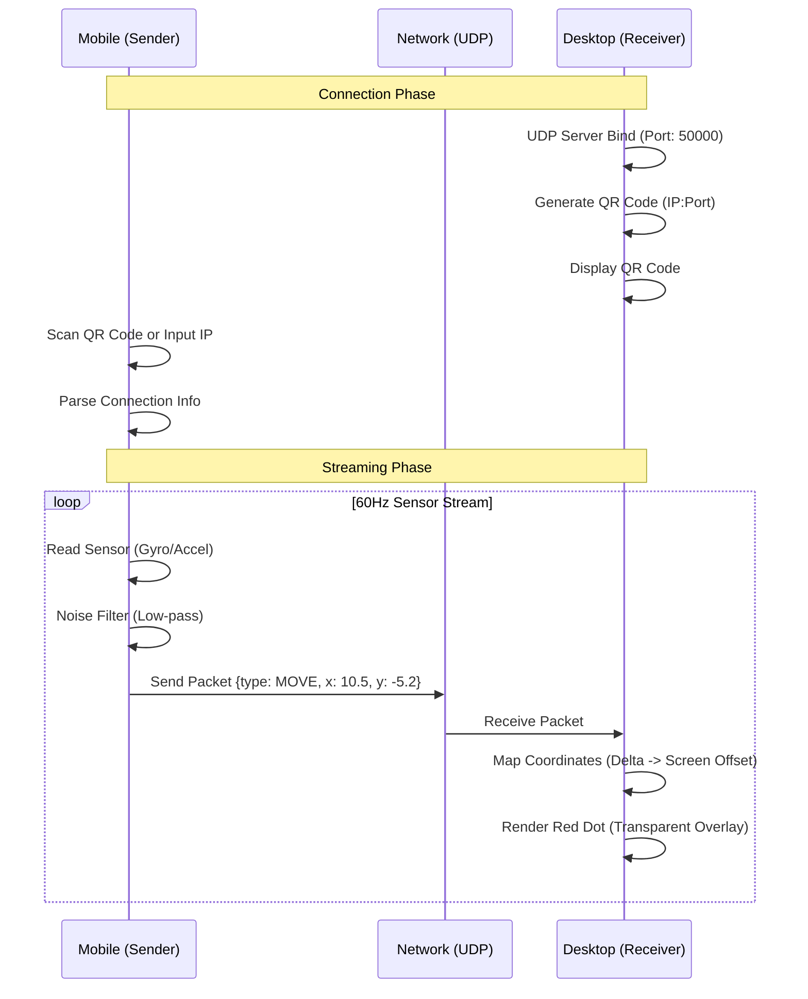

# Functional Specifications (기능 명세서)

## 1. 시스템 구조 (System Architecture)
본 시스템은 **UDP**을 기반으로 하는 **Sender-Receiver** 구조를 따른다.

**플랫폼 지원:**
- 모바일: Android, iOS
- PC: Windows, macOS
- 웹(Web) 플랫폼은 지원하지 않음

## 2. 데이터 프로토콜 (Data Protocol)
모바일과 PC 간의 통신은 JSON 포맷의 문자열을 UTF-8로 인코딩하여 전송한다.

### 2.1. 패킷 구조 (LaserPacket)

| 필드명 | 타입 | 설명 | 예시 |
|--------|------|------|------|
| type | String | 이벤트 타입 (MOVE, CLICK_DOWN, CLICK_UP) | "MOVE" |
| dx | Double | X축 변화량 (상대 좌표) | 12.5 |
| dy | Double | Y축 변화량 (상대 좌표) | -4.3 |
| ts | Long | 패킷 생성 시간 (Timestamp, 순서 보정용) | 1709452000 |

## 3. 상세 기능 명세 (Detailed Functions)

### 3.1. Sender (Mobile App)

**FUNC-S-01 (Sensor)**: `sensors_plus` 패키지의 `UserAccelerometer` 이벤트를 60Hz 주기로 수집한다.

**FUNC-S-02 (Filtering)**: 손떨림 방지를 위해 이동 평균(Moving Average) 또는 지수 평활(Exponential Smoothing) 필터를 적용한다.

**FUNC-S-03 (Network)**: `RawDatagramSocket`을 사용하여 비연결성 UDP 패킷을 전송한다. 전송 실패 시 재전송하지 않는다 (실시간성 우선).

**FUNC-S-04 (UI)**: 연결 상태(연결됨/끊김)를 시각적으로 표시하고, IP 입력 필드와 연결 버튼을 제공한다.

**FUNC-S-05 (QR Code)**: `mobile_scanner` 또는 `qr_code_scanner` 패키지를 사용하여 PC에서 생성된 QR 코드를 스캔하여 연결 정보(IP 주소, 포트)를 자동으로 획득한다.

### 3.2. Receiver (Desktop App)

**FUNC-R-01 (Window)**: `window_manager`를 사용하여 배경을 투명(`Colors.transparent`)하게 설정하고, 타이틀바를 제거한다.

**FUNC-R-02 (Overlay)**: 윈도우 속성을 `CheckAlwaysOnTop`으로 설정하여 다른 창 위에 표시한다.

**FUNC-R-03 (Interaction)**: `setIgnoreMouseEvents(true)`를 호출하여 마우스 이벤트가 투명 영역을 통과하여 뒤쪽 앱에 전달되도록 한다.

**FUNC-R-04 (Rendering)**: 수신된 `dx`, `dy` 값을 누적하여 현재 화면 해상도(`Screen.size`) 내의 절대 좌표 `(x, y)`로 변환하고 `Stack` 위젯 내 `Positioned`로 포인터를 그린다.

**FUNC-R-05 (QR Code Generation)**: `qr_flutter` 또는 `qr_code` 패키지를 사용하여 현재 PC의 IP 주소와 포트(50000) 정보를 포함한 QR 코드를 생성하고 화면에 표시한다. QR 코드 형식은 JSON 문자열로 `{"ip": "192.168.0.1", "port": 50000}` 형태를 사용한다.

## 4. 예외 처리 (Error Handling)

**ERR-01 (Network)**: 잘못된 IP 형식 입력 시 사용자에게 "유효하지 않은 IP입니다" 토스트 메시지를 출력한다.

**ERR-04 (QR Code)**: QR 코드 스캔 실패 또는 잘못된 형식의 QR 코드 인식 시 사용자에게 "QR 코드를 인식할 수 없습니다" 메시지를 표시하고 수동 IP 입력으로 전환할 수 있도록 한다.

**ERR-02 (Permission)**: 센서 접근 권한 거부 시 설정 화면으로 유도하는 다이얼로그를 표시한다.

**ERR-03 (Bind Fail)**: PC에서 포트(50000) 바인딩 실패 시(이미 실행 중 등), "서버 시작 실패" 에러 로그를 남기고 다른 포트 사용을 시도하거나 종료한다.
